<!-- ═══════════════════════════════════════════════════════════════════ -->
<!--                     ANIMATED PROFILE ART                           -->
<!-- ═══════════════════════════════════════════════════════════════════ -->

  

<table>
  <tr>
    <td valign="top"></td>
    <td valign="top"></td>
  </tr>
</table>

 

<!-- Profile Views + Stars -->

&nbsp;

&nbsp;

<!-- ═══════════════════════════════════════════════════════════════════ -->
<!--                     TECH STACK                                     -->
<!-- ═══════════════════════════════════════════════════════════════════ -->

##  &nbsp;`$ cat tech_stack.yml`

 

  

 
<!-- ═══════════════════════════════════════════════════════════════════ -->
<!--                     GITHUB STATS                                   -->
<!-- ═══════════════════════════════════════════════════════════════════ -->

 

<!-- Activity Graph -->

  

<!-- Stats & Languages Cards -->

&nbsp;

  

<!-- Streak Stats -->

  

<!-- ═══════════════════════════════════════════════════════════════════ -->
<!--                     CONNECT                                        -->
<!-- ═══════════════════════════════════════════════════════════════════ -->

### 🤝 &nbsp;`$ curl --connect`

 

&nbsp;

&nbsp;

&nbsp;

&nbsp;

&nbsp;

  

---

 

