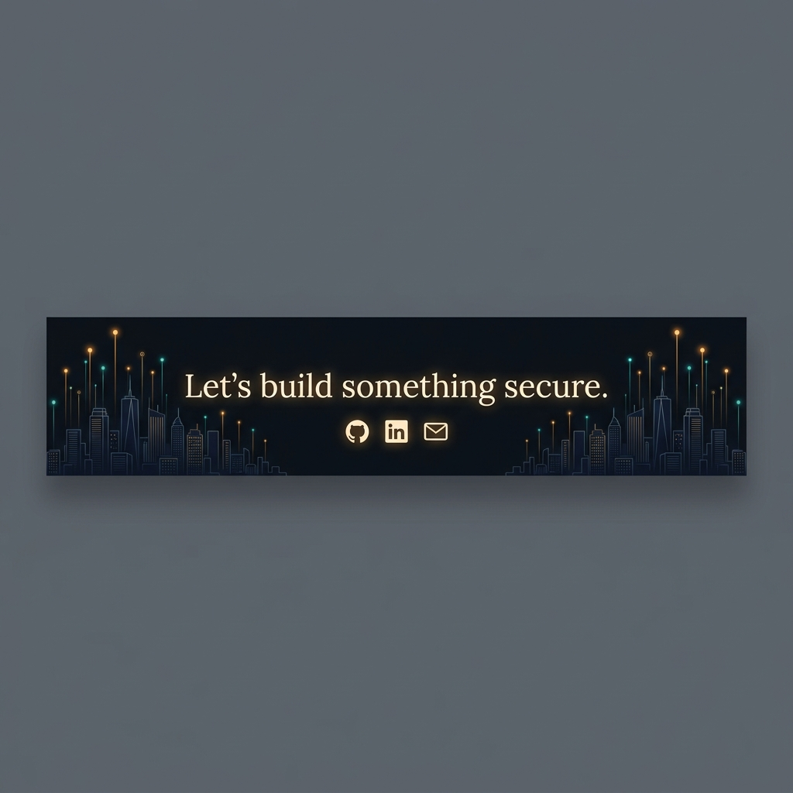

<div align="center">

```
     ██████╗ ██╗  ██╗██████╗ ██╗   ██╗██╗   ██╗
     ██╔══██╗██║  ██║██╔══██╗██║   ██║██║   ██║
     ██║  ██║███████║██████╔╝██║   ██║██║   ██║
     ██║  ██║██╔══██║██╔══██╗██║   ██║╚██╗ ██╔╝
     ██████╔╝██║  ██║██║  ██║╚██████╔╝ ╚████╔╝
     ╚═════╝ ╚═╝  ╚═╝╚═╝  ╚═╝ ╚═════╝   ╚═══╝
```

<!-- ═══════════════════════════════════════════════════════════════════ -->
<!--                     ANIMATED TYPING INTRO                          -->
<!-- ═══════════════════════════════════════════════════════════════════ -->

<br/>

<a href="https://git.io/typing-svg"></a>

<br/>

<!-- Profile Views + Stars -->

&nbsp;
<a href="https://github.com/Eurt-labs?tab=repositories"></a>
&nbsp;
<a href="https://dhruvv.app"></a>

</div>

<!-- ═══════════════════════════════════════════════════════════════════ -->
<!--                     SECTION DIVIDER                                -->
<!-- ═══════════════════════════════════════════════════════════════════ -->


<!-- ═══════════════════════════════════════════════════════════════════ -->
<!--                     ABOUT ME — TERMINAL STYLE                      -->
<!-- ═══════════════════════════════════════════════════════════════════ -->

##  &nbsp;`$ whoami`

```yaml
name: Dhruv Sharma
alias: Eurt-labs
title: Cloud Engineer | Developer
location: Delhi, India 🇮🇳
portfolio: https://dhruvv.app
email: dhruv15saraswat@gmail.com

currently:
  working_on: "AI-Powered Threat Intelligence Platform"
  learning: "LLM Modulation · Cloud Architecture · Adversarial ML"
  exploring: "MTproto Protocol · Dijkstra at Scale"

fun_fact: "I build beautiful things and I break Things to see how they bleed. 🩸"
```

<br/>

<!-- ═══════════════════════════════════════════════════════════════════ -->
<!--                     WHAT I DO — ANIMATED CARDS                     -->
<!-- ═══════════════════════════════════════════════════════════════════ -->

<div align="center">

<table>
<tr>
<td width="50%" valign="top">

###  &nbsp;Offensive Security

- 🔴 **VAPT** — Web, Network & Android Pentesting
- 🧬 **Reverse Engineering** — jadx, Frida, ADB
- 🕵️ **DFIR** — AI-Assisted Digital Forensics
- 🎯 **Bug Bounty** — Auth bypass in production apps
- 🛡️ **OWASP** — Full Mobile Top 10 coverage

</td>
<td width="50%" valign="top">

###  &nbsp;Engineering & Architecture

- 📱 **Mobile** — Native Android (Kotlin + Jetpack)
- 🌐 **Web** — Next.js, React, Node.js, Express
- ⚡ **Edge AI** — ESP32 Firmware, Sensor Systems
- ☁️ **Cloud** — AWS, GCP, Docker, CI/CD
- 🤖 **AI/ML** — LLM Integration, PyTorch

</td>
</tr>
</table>

</div>

<!-- ═══════════════════════════════════════════════════════════════════ -->
<!--                     TECH STACK                                     -->
<!-- ═══════════════════════════════════════════════════════════════════ -->

##  &nbsp;`$ cat tech_stack.yml`

<div align="center">

<br/>

#### 💻 Languages & Core


<br/><br/>

#### 🛠️ Frameworks & Libraries


<br/><br/>

#### 🗄️ Databases & Infrastructure


<br/><br/>

#### 🔧 Tools & Platforms


<br/><br/>

#### 🛡️ Security Arsenal
<p>


</p>

</div>

<br/>
<!-- ═══════════════════════════════════════════════════════════════════ -->
<!--                     GITHUB STATS                                   -->
<!-- ═══════════════════════════════════════════════════════════════════ -->

##  &nbsp;`$ git stats --verbose`

<div align="center">

<br/>

<!-- Activity Graph -->


<br/><br/>

<!-- Streak Stats -->


<br/><br/>

</div>

<!-- ═══════════════════════════════════════════════════════════════════ -->
<!--                     CONTRIBUTION SNAKE                             -->
<!-- ═══════════════════════════════════════════════════════════════════ -->

## 🐍 &nbsp;`$ watch -n1 contribution_snake`

<div align="center">
<br/>

<picture>
  <source media="(prefers-color-scheme: dark)" srcset="https://raw.githubusercontent.com/Eurt-labs/Eurt-labs/output/github-snake-dark.svg" />
  <source media="(prefers-color-scheme: light)" srcset="https://raw.githubusercontent.com/Eurt-labs/Eurt-labs/output/github-snake.svg" />
  
</picture>


</div>

<br/>

<!-- ═══════════════════════════════════════════════════════════════════ -->
<!--                     CONNECT                                        -->
<!-- ═══════════════════════════════════════════════════════════════════ -->

<div align="center">



<br/><br/>

### 🤝 &nbsp;`$ curl --connect`

<br/>

<a href="https://dhruvv.app"></a>
&nbsp;
<a href="https://github.com/Eurt-labs"></a>
&nbsp;
<a href="https://linkedin.com/in/dhruv-saraswat-vrtl"></a>
&nbsp;
<a href="https://instagram.com/dhruv_saraswat_"></a>
&nbsp;
<a href="https://dev.to/eurtlabs"></a>
&nbsp;
<a href="mailto:dhruv15saraswat@gmail.com"></a>

<br/><br/>

<!-- Download Resume -->
<a href="https://dhruvv.app/resume.pdf">

</a>

<br/><br/>

---

<br/>


<br/>

<samp>

**"I build beautiful things, then break them to see how they bleed."**

*Last updated: June 2026 · Built with ☕ and paranoia*

</samp>

</div>
